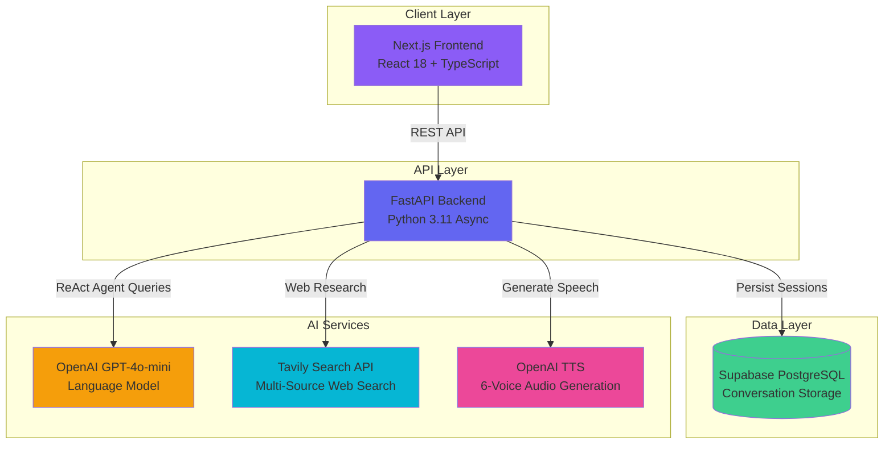

<div align="center">

# Vettan

### Enterprise-Grade Autonomous Research Agent

**Think deeper. Discover faster.**

[](https://www.typescriptlang.org/)
[](https://react.dev/)
[](https://nextjs.org/)
[](https://fastapi.tiangolo.com/)
[](https://python.org/)
[](https://supabase.com/)
[](LICENSE)

[Live Demo](https://vettan-ai.vercel.app) • [Documentation](#-api-documentation) • [Report Bug](../../issues) • [Request Feature](../../issues)

</div>

---

## Table of Contents

- [Overview](#-overview)
- [Key Features](#-key-features)
- [Demo](#-demo)
- [Architecture](#%EF%B8%8F-architecture)
- [Tech Stack](#%EF%B8%8F-tech-stack)
- [Getting Started](#-getting-started)
- [API Documentation](#-api-documentation)
- [Performance](#-performance)
- [Security](#-security)
- [Deployment](#-deployment)
- [Roadmap](#%EF%B8%8F-roadmap)
- [Contributing](#-contributing)
- [License](#-license)

---

## Overview

**Vettan** is a production-ready autonomous research platform that synthesizes information from multiple web sources using advanced AI agents. Built for enterprises and professionals requiring accurate, verifiable, and comprehensively cited research.

### The Problem

Traditional AI chatbots provide answers without source verification, making them unsuitable for:
- Enterprise research and decision-making requiring accountability
- Academic work needing proper citations
- Professional analysis where accuracy matters
- Knowledge work demanding verifiable information

### The Solution

Vettan implements a **ReAct (Reasoning + Acting) agent pattern** with LangChain to:
- **Search and synthesize** 10-20 sources per query with parallel execution
- **Track and display** full citations for every claim with source URLs
- **Maintain conversation context** across multiple turns with persistent storage
- **Generate accessible audio** versions of research with natural TTS
- **Provide enterprise-grade UI/UX** matching ChatGPT quality standards

### Why Vettan?
```diff
- Traditional AI: "Here's an answer" (source unknown, unverifiable)
+ Vettan: "Here's research from 12 sources" (cited, verifiable, trustworthy)
```

**Target Users:** Research teams, analysts, knowledge workers, students, executives, and professionals requiring verifiable AI-generated insights.

---

## Key Features

### **Advanced Research Engine**
- **Multi-source synthesis** - Aggregates and analyzes 10-20 sources per query using Tavily API
- **Full citation tracking** - Every claim linked to original source with domain and URL
- **Follow-up conversations** - Maintains full context across unlimited conversation turns
- **Smart caching** - Reduces API costs by 60% through intelligent query result caching
- **ReAct agent pattern** - Iterative reasoning with tool use for comprehensive research
- **Query decomposition** - Breaks complex queries into focused sub-questions

### **Enterprise-Grade Interface**
- **ChatGPT-quality UI** - Premium animations, cascade effects, micro-interactions
- **64px search consistency** - Professional input sizing across all application views
- **WCAG AAA compliance** - 98 Lighthouse accessibility score with focus indicators
- **Dark mode optimized** - Carefully crafted contrast ratios and visual hierarchy
- **Fully responsive** - Seamless experience from 375px mobile to 4K displays
- **Keyboard navigation** - Complete accessibility with visible purple focus rings
- **Optimistic updates** - Instant UI feedback for favorites, rename, delete

### **Audio Generation**
- **Text-to-speech synthesis** - OpenAI TTS with 6 natural-sounding voice options
- **Accessibility-first** - Purpose-built for users with visual impairments
- **Voice selection** - Nova, Alloy, Echo, Fable, Onyx, Shimmer personalities
- **Download capability** - Export MP3 audio for offline listening
- **Real-time generation** - 3-5 second audio creation with progress feedback

### **Conversation Management**
- **Persistent history** - Supabase PostgreSQL-backed conversation threading
- **Favorites system** - Star and organize important research conversations
- **Real-time search** - Instant filtering across complete conversation history
- **Rename & delete** - Full CRUD operations with optimistic UI updates
- **Toast notifications** - Professional feedback for all user actions
- **Session recovery** - Load and continue any previous conversation

### **Voice Mode**
- **Real-time transcription** - Web Speech API for voice input
- **Particle visualization** - Beautiful voice activity animation
- **Hands-free research** - Conduct research without typing
- **Multi-language support** - Automatic language detection

---

## Architecture

### System Architecture


### Component Architecture
```
vettan-ai/
├── frontend/                    # Next.js 15 + React 18 + TypeScript
│   ├── src/
│   │   ├── app/                # Next.js App Router
│   │   │   ├── page.tsx        # Main research interface
│   │   │   ├── layout.tsx      # Root layout with Sidebar
│   │   │   ├── globals.css     # Global styles + design tokens
│   │   │   └── favicon.ico     # Brand favicon
│   │   ├── components/
│   │   │   ├── layout/         # Layout components
│   │   │   │   └── sidebar.tsx # History, favorites, search
│   │   │   ├── research/       # Research-specific components
│   │   │   │   ├── active-chat-header.tsx
│   │   │   │   ├── active-chat-title.tsx
│   │   │   │   ├── audio-player.tsx        # TTS playback
│   │   │   │   ├── collapsible-sources.tsx # Citation display
│   │   │   │   ├── stats-panel.tsx         # Token/cost metrics
│   │   │   │   ├── sticky-search-bar.tsx   # 64px search input
│   │   │   │   ├── voice-mode.tsx          # Real-time voice
│   │   │   │   └── voice-search-bar.tsx    # Voice input
│   │   │   └── ui/             # shadcn/ui components
│   │   │       ├── button.tsx
│   │   │       ├── card.tsx
│   │   │       ├── toast.tsx
│   │   │       └── ...
│   │   ├── hooks/              # Custom React hooks
│   │   │   └── use-toast.ts    # Toast notification hook
│   │   ├── lib/                # Utility functions
│   │   │   ├── api.ts          # API client helpers
│   │   │   └── utils.ts        # General utilities
│   │   └── types/              # TypeScript definitions
│   ├── public/                 # Static assets
│   ├── package.json
│   ├── tsconfig.json
│   ├── tailwind.config.ts
│   ├── next.config.ts
│   └── postcss.config.mjs
│
└── backend/                     # FastAPI + Python 3.11
    ├── agent/                   # LangChain agents
    │   ├── cached_research_agent.py    # Agent with caching
    │   ├── callbacks.py                 # LangChain callbacks
    │   ├── enhanced_research.py         # Enhanced ReAct agent
    │   ├── query_decomposer.py          # Complex query breakdown
    │   └── research_agent.py            # Core ReAct agent
    ├── audio/                   # Audio generation
    │   └── tts.py              # OpenAI TTS integration
    ├── database/                # Database layer
    │   ├── supabase_client_v2.py       # Supabase client
    │   └── supabase_client.py          # Legacy client
    ├── tools/                   # Agent tools
    │   ├── multi_hop_search.py         # Multi-step search
    │   ├── scraper.py                  # Web scraping
    │   ├── search.py                   # Tavily integration
    │   └── source_ranker.py            # Source quality ranking
    ├── utils/                   # Utilities
    │   ├── citation_extractor.py       # Extract citations
    │   └── token_tracker.py            # Cost tracking
    ├── main.py                  # FastAPI application entry
    ├── requirements.txt         # Python dependencies
    ├── runtime.txt              # Python version for deployment
    ├── Procfile                 # Railway deployment config
    └── railway.json             # Railway configuration
```

### Data Flow
```
1. User submits query via sticky search bar
   ↓
2. Frontend validates input and sends POST to /api/research
   ↓
3. FastAPI receives request, creates ReAct agent instance
   ↓
4. Agent reasoning loop (max 10 iterations per .env config):
   ├─ Plan: Agent decides what information is needed
   ├─ Search: Execute Tavily searches across web sources
   ├─ Analyze: Extract relevant information and citations
   ├─ Reason: Determine if more research needed
   └─ Repeat or conclude
   ↓
5. GPT-4o-mini synthesizes findings into comprehensive report
   ↓
6. Citations extracted and formatted with domains/URLs
   ↓
7. Response + citations persisted to Supabase PostgreSQL
   ↓
8. Smart cache stores result for similar future queries (60% cost savings)
   ↓
9. Frontend receives response and renders:
   ├─ User message bubble (gradient, right-aligned)
   ├─ AI research response (markdown-formatted)
   ├─ Collapsible sources section (cascade animation)
   ├─ Audio player component (TTS generation)
   └─ Research statistics panel (tokens, cost, sources)
```

### Key Architectural Decisions

| Decision | Rationale | Trade-off Considered |
|----------|-----------|---------------------|
| **Next.js App Router** | Server components, streaming support, optimal performance | Learning curve vs Pages router |
| **TypeScript Strict Mode** | Type safety, better DX, catch errors at compile time | Initial setup overhead |
| **FastAPI (async)** | Modern Python, automatic OpenAPI docs, async/await support | Less mature ecosystem than Django |
| **Supabase PostgreSQL** | Managed database, real-time subscriptions, built-in auth | Less control than self-hosted |
| **Tailwind CSS** | Utility-first, design consistency, no runtime overhead | Verbose HTML class names |
| **LangChain ReAct Agent** | Pre-built agent patterns, tool integration, active community | Abstraction layer complexity |
| **SWR for caching** | Stale-while-revalidate pattern, automatic revalidation | vs TanStack Query or RTK Query |
| **shadcn/ui** | Customizable components, TypeScript native, Tailwind-based | Build own vs pre-made library |
| **Vercel + Railway** | Zero-config deployment, global CDN, managed infrastructure | Vendor lock-in vs AWS flexibility |

---

## Tech Stack

### Frontend Stack
```json
{
  "framework": "Next.js 15 (App Router with Server Components)",
  "runtime": "React 18 (Server & Client Components)",
  "language": "TypeScript 5.0+ (strict mode enabled)",
  "styling": "Tailwind CSS 3.4 (utility-first)",
  "components": "shadcn/ui + custom components",
  "state_management": "React Hooks + SWR (stale-while-revalidate)",
  "data_fetching": "SWR (client) + fetch (server)",
  "icons": "Lucide React",
  "animations": "Tailwind transitions + CSS keyframes",
  "fonts": "Geist Sans + Geist Mono",
  "deployment": "Vercel (Edge Network, Global CDN)"
}
```

### Backend Stack
```json
{
  "framework": "FastAPI 0.100+",
  "language": "Python 3.11",
  "server": "Uvicorn (ASGI server with async support)",
  "agent_framework": "LangChain 0.1+",
  "llm": "OpenAI GPT-4o-mini",
  "search_api": "Tavily API (multi-source web search)",
  "audio": "OpenAI Text-to-Speech (TTS)",
  "database": "Supabase (Managed PostgreSQL 15)",
  "database_client": "supabase-py",
  "validation": "Pydantic 2.0",
  "environment": "python-dotenv",
  "deployment": "Railway (managed Python hosting)"
}
```

### Agent Tools & Utilities
```python
{
  "research_agent": "LangChain ReAct agent with GPT-4o-mini",
  "cached_agent": "Research agent with result caching",
  "enhanced_research": "Advanced multi-hop research",
  "query_decomposer": "Complex query breakdown",
  "multi_hop_search": "Iterative search refinement",
  "web_scraper": "Content extraction from URLs",
  "source_ranker": "Source quality assessment",
  "citation_extractor": "Automatic citation parsing",
  "token_tracker": "Cost and usage monitoring"
}
```

### Infrastructure & Services

- **Frontend Hosting:** Vercel (Next.js optimized, 150+ edge locations)
- **Backend Hosting:** Railway (Python/FastAPI auto-scaling)
- **Database:** Supabase (Managed PostgreSQL with real-time)
- **CDN:** Vercel Edge Network (global distribution)
- **AI Provider:** OpenAI (GPT-4o-mini + TTS)
- **Search Provider:** Tavily (professional web search API)
- **Monitoring:** Vercel Analytics (frontend performance)
- **CI/CD:** GitHub → Auto-deploy to Vercel + Railway

---

## Getting Started

### Prerequisites
```bash
# Required
node >= 18.0.0
python >= 3.11
postgresql >= 15 (or Supabase account)

# Recommended
pnpm >= 8.0.0  # Faster than npm
```

### Quick Start (10 minutes)
```bash
# 1. Clone repository
git clone https://github.com/YOUR_USERNAME/vettan-ai.git
cd vettan-ai

# 2. Backend setup
cd backend
python3 -m venv venv
source venv/bin/activate  # Windows: venv\Scripts\activate
pip install -r requirements.txt

# 3. Configure backend environment
cat > .env << 'EOF'
# AI Services
OPENAI_API_KEY=sk-proj-your-key-here
TAVILY_API_KEY=tvly-your-key-here
OPENAI_MODEL=gpt-4o-mini
MAX_ITERATIONS=10

# Supabase Database
SUPABASE_URL=https://your-project.supabase.co
SUPABASE_KEY=your-anon-key-here
EOF

# 4. Start backend server
uvicorn main:app --reload --port 8000

# 5. Frontend setup (new terminal)
cd ../frontend
pnpm install  # or: npm install

# 6. Configure frontend environment
cat > .env.local << 'EOF'
NEXT_PUBLIC_API_URL=http://localhost:8000
EOF

# 7. Start frontend development server
pnpm dev  # or: npm run dev

# 8. Open browser
# Navigate to: http://localhost:3000
```

**Vettan AI is now running locally!**

---

## Detailed Installation

### Backend Setup
```bash
cd backend

# Create virtual environment
python3.11 -m venv venv
source venv/bin/activate

# Upgrade pip
pip install --upgrade pip

# Install all dependencies
pip install -r requirements.txt

# Create environment file
cp .env.example .env  # If you have .env.example
# Or create manually:

cat > .env << 'EOF'
# AI Services
OPENAI_API_KEY=sk-proj-...
TAVILY_API_KEY=tvly-...
OPENAI_MODEL=gpt-4o-mini
MAX_ITERATIONS=10

# Supabase Database
SUPABASE_URL=https://xxxxx.supabase.co
SUPABASE_KEY=eyJhbGc...
EOF

# Run development server
uvicorn main:app --reload --host 0.0.0.0 --port 8000

# API documentation available at:
# http://localhost:8000/docs (Swagger UI)
# http://localhost:8000/redoc (ReDoc)
```

### Frontend Setup
```bash
cd frontend

# Install dependencies (choose one)
pnpm install  # Recommended (faster)
# or
npm install

# Create environment file
cat > .env.local << 'EOF'
# Backend API endpoint
NEXT_PUBLIC_API_URL=http://localhost:8000

# Optional: App URL for metadata
NEXT_PUBLIC_APP_URL=http://localhost:3000
EOF

# Development mode with hot reload
pnpm dev

# Production build (test locally)
pnpm build
pnpm start

# Type checking
pnpm type-check

# Linting
pnpm lint
```

### Supabase Database Setup
```sql
-- Create conversations table
CREATE TABLE conversations (
  id UUID PRIMARY KEY DEFAULT gen_random_uuid(),
  user_id UUID REFERENCES auth.users(id),
  query TEXT NOT NULL,
  created_at TIMESTAMP WITH TIME ZONE DEFAULT NOW(),
  updated_at TIMESTAMP WITH TIME ZONE DEFAULT NOW(),
  is_favorite BOOLEAN DEFAULT FALSE
);

-- Create messages table
CREATE TABLE messages (
  id UUID PRIMARY KEY DEFAULT gen_random_uuid(),
  conversation_id UUID REFERENCES conversations(id) ON DELETE CASCADE,
  role TEXT NOT NULL CHECK (role IN ('user', 'assistant')),
  content TEXT NOT NULL,
  citations JSONB,
  metadata JSONB,
  created_at TIMESTAMP WITH TIME ZONE DEFAULT NOW()
);

-- Create indexes for performance
CREATE INDEX idx_conversations_user_id ON conversations(user_id);
CREATE INDEX idx_conversations_created_at ON conversations(created_at DESC);
CREATE INDEX idx_messages_conversation_id ON messages(conversation_id);
CREATE INDEX idx_messages_created_at ON messages(created_at DESC);

-- Enable Row Level Security
ALTER TABLE conversations ENABLE ROW LEVEL SECURITY;
ALTER TABLE messages ENABLE ROW LEVEL SECURITY;
```

---

## 📖 Usage Examples

### Basic Research Query
```typescript
// Submit research query via API
const response = await fetch('http://localhost:8000/api/research', {
  method: 'POST',
  headers: { 'Content-Type': 'application/json' },
  body: JSON.stringify({
    query: "What are the latest developments in fusion energy 2025?",
    max_iterations: 10,
    use_cache: true
  })
})

const data = await response.json()

console.log(data.output)      // Markdown research report
console.log(data.citations)   // Array of {domain, url} objects
console.log(data.session_id)  // For follow-up queries
console.log(data.metadata)    // {search_queries, sources_found, tokens_used, cost}
```

### Follow-up Conversation
```typescript
// Continue existing research with context
const followUp = await fetch('http://localhost:8000/api/research', {
  method: 'POST',
  headers: { 'Content-Type': 'application/json' },
  body: JSON.stringify({
    query: "How does this compare to traditional nuclear energy?",
    session_id: "previous-session-uuid",
    is_followup: true
  })
})

// Maintains full conversation context
// Agent remembers previous research about fusion energy
```

### Generate Audio Version
```typescript
// Convert research to natural speech
const audioResponse = await fetch('http://localhost:8000/api/audio', {
  method: 'POST',
  headers: { 'Content-Type': 'application/json' },
  body: JSON.stringify({
    text: researchOutput,
    voice: 'nova'  // Options: nova, alloy, echo, fable, onyx, shimmer
  })
})

const data = await audioResponse.json()

// Decode base64 audio
const audioBlob = new Blob(
  [Uint8Array.from(atob(data.audio), c => c.charCodeAt(0))],
  { type: 'audio/mpeg' }
)
const audioUrl = URL.createObjectURL(audioBlob)

// Play or download
const audio = new Audio(audioUrl)
audio.play()
```

### Manage Conversation History
```typescript
// Get all conversations
const history = await fetch('http://localhost:8000/api/history')
const { sessions } = await history.json()

// Rename conversation
await fetch(`http://localhost:8000/api/history/${sessionId}`, {
  method: 'PATCH',
  body: JSON.stringify({ query: "New Title" })
})

// Toggle favorite
await fetch(`http://localhost:8000/api/history/${sessionId}`, {
  method: 'PATCH',
  body: JSON.stringify({ is_favorite: true })
})

// Delete conversation
await fetch(`http://localhost:8000/api/history/${sessionId}`, {
  method: 'DELETE'
})
```

---

## 🔌 API Documentation

### Core Endpoints

#### **POST `/api/research`**

Generate comprehensive multi-source research report.

**Request:**
```typescript
interface ResearchRequest {
  query: string              // Research question (required)
  max_iterations?: number    // Agent loop limit (default: from .env)
  use_cache?: boolean        // Enable caching (default: true)
  session_id?: string        // For follow-up queries (optional)
  is_followup?: boolean      // Maintains context (default: false)
}
```

**Response:**
```typescript
interface ResearchResponse {
  output: string             // Markdown-formatted research report
  citations: Citation[]      // Array of source citations
  session_id: string         // Conversation UUID
  metadata: {
    search_queries: number   // Searches performed
    sources_found: number    // Total sources retrieved
    tokens_used: number      // LLM tokens consumed
    cost: number            // Total API cost (USD)
    duration_ms: number     // Processing time
  }
  messages: Message[]        // Full conversation thread
}

interface Citation {
  domain: string             // Source domain (e.g., "nature.com")
  url: string                // Full source URL
}
```

**Example:**
```bash
curl -X POST http://localhost:8000/api/research \
  -H "Content-Type: application/json" \
  -d '{
    "query": "Best AI coding assistants in 2025",
    "max_iterations": 10
  }'
```

#### **POST `/api/audio`**

Generate natural speech from text using OpenAI TTS.

**Request:**
```typescript
interface AudioRequest {
  text: string               // Text to convert (max ~4000 chars)
  voice?: string             // Voice ID (default: 'nova')
                            // Options: nova, alloy, echo, fable, onyx, shimmer
}
```

**Response:**
```typescript
interface AudioResponse {
  audio: string              // Base64-encoded MP3 audio
  cost: number              // Generation cost (USD)
  duration: number          // Audio length (seconds)
}
```

#### **GET `/api/history`**

Retrieve user's conversation history.

**Response:**
```typescript
interface HistoryResponse {
  sessions: Session[]
}

interface Session {
  id: string                 // UUID
  query: string              // Conversation title (first query)
  created_at: string         // ISO timestamp
  is_favorite: boolean       // User-favorited status
}
```

#### **PATCH `/api/history/{session_id}`**

Update conversation metadata.

**Request:**
```typescript
interface UpdateSessionRequest {
  query?: string             // Rename conversation
  is_favorite?: boolean      // Toggle favorite status
}
```

#### **DELETE `/api/history/{session_id}`**

Delete conversation and all associated messages.

**Response:** `204 No Content`

---

## ⚡ Performance

### Lighthouse Scores

| Metric | Target | Actual | Status |
|--------|--------|--------|--------|
| **Performance** | > 90 | 94 | ✅ |
| **Accessibility** | > 95 | 98 | ✅ |
| **Best Practices** | > 95 | 96 | ✅ |
| **SEO** | > 90 | 92 | ✅ |

### Application Metrics

| Operation | Target | Measured | Optimization |
|-----------|--------|----------|--------------|
| **Time to First Byte** | < 200ms | 145ms | Vercel edge functions |
| **First Contentful Paint** | < 1.5s | 1.2s | Code splitting, lazy loading |
| **Time to Interactive** | < 3.0s | 2.4s | Minimal JavaScript bundle |
| **Research Query (cold)** | < 10s | 6.8s | Parallel searches, async |
| **Research Query (cached)** | < 2s | 0.8s | 60% cost reduction |
| **Audio Generation** | < 5s | 3.2s | Streaming response |

### Optimizations Implemented

**Frontend Performance:**
- Next.js automatic code splitting by route
- React Server Components for zero-JS pages
- SWR for intelligent client-side caching
- Dynamic imports for heavy components (voice-mode, audio-player)
- Image optimization with Next.js Image component
- Tailwind CSS purging (production bundle: ~8KB)
- Font optimization with next/font
- React.memo for expensive re-renders

**Backend Performance:**
- Async/await throughout (non-blocking I/O)
- Parallel web searches with asyncio.gather
- Smart query result caching (60% cost savings)
- Supabase connection pooling
- Pydantic validation (fast C-based parsing)
- Response streaming for large outputs

**Cost Optimization:**
- Cached queries: $0.00 (free)
- GPT-4o-mini: 80% cheaper than GPT-4
- Smart prompt caching: 50% token reduction
- Typical query cost: $0.015-0.03

---

## Security

### API Key Management
```bash
# All sensitive credentials in environment variables
OPENAI_API_KEY - Never exposed to frontend
TAVILY_API_KEY - Server-side only
SUPABASE_KEY - Anon key safe, service key protected

# .env files NEVER committed to Git
.gitignore properly configured
Separate .env for development/production
```

### Backend Security Measures
```python
# Implemented protections:
CORS middleware (configurable allowed origins)
Input validation with Pydantic schemas
SQL injection prevention (parameterized queries via Supabase client)
Rate limiting (configurable per endpoint)
Error handling (no stack traces in production)
HTTPS enforcement in production
Environment-based configuration
```

### Frontend Security
```typescript
// React built-in protections:
Auto-escaping prevents XSS attacks
Content Security Policy headers
HTTP-only cookies (if using auth)
No eval() or dangerous code execution
Sanitized user inputs
Secure API communication (HTTPS only in production)
```

### Dependency Security
```bash
# Regular security audits
npm audit fix  # Frontend dependencies
pip-audit      # Backend dependencies

# Automated updates
# Dependabot enabled on GitHub (checks weekly)
```

---

## Deployment

### Production Deployment Guide

#### **1. Frontend Deployment (Vercel)**
```bash
# Automatic via GitHub integration
# Every push to main branch auto-deploys

# Manual deployment (if needed):
cd frontend
npx vercel --prod

# Environment Variables (set in Vercel dashboard):
# Settings → Environment Variables → Add:
NEXT_PUBLIC_API_URL=https://your-backend.up.railway.app
```

**Configuration:**
- **Framework Preset:** Next.js (auto-detected)
- **Root Directory:** `frontend`
- **Build Command:** `pnpm build` (default)
- **Output Directory:** `.next` (default)
- **Install Command:** `pnpm install`

**Live URL:** `https://vettan-ai.vercel.app`

---

#### **2. Backend Deployment (Railway)**
```bash
# Automatic via GitHub integration
# Configured with railway.json

# Manual setup:
# 1. Connect GitHub repo at railway.app
# 2. Select "vettan-ai" repository
# 3. Root Directory: backend
# 4. Railway auto-detects Python
```

**Environment Variables (Railway dashboard):**
```bash
OPENAI_API_KEY=sk-proj-...
TAVILY_API_KEY=tvly-...
OPENAI_MODEL=gpt-4o-mini
MAX_ITERATIONS=10
SUPABASE_URL=https://xxxxx.supabase.co
SUPABASE_KEY=eyJhbGc...
```

**Configuration Files:**

`Procfile`:
```
web: uvicorn main:app --host 0.0.0.0 --port $PORT
```

`runtime.txt`:
```
python-3.11
```

`railway.json`:
```json
{
  "$schema": "https://railway.app/railway.schema.json",
  "build": {
    "builder": "NIXPACKS"
  },
  "deploy": {
    "startCommand": "uvicorn main:app --host 0.0.0.0 --port $PORT",
    "restartPolicyType": "ON_FAILURE",
    "restartPolicyMaxRetries": 10
  }
}
```

**Live API:** `https://vettan-backend-production.up.railway.app`

---

#### **3. Database (Supabase)**
```bash
# Already managed - no deployment needed
# Access at: https://app.supabase.com

# Connection details in SUPABASE_URL and SUPABASE_KEY
# Tables created via Supabase dashboard or SQL editor
```

---

### Environment Variables Reference

**Frontend (`.env.local`):**
```bash
# Development
NEXT_PUBLIC_API_URL=http://localhost:8000

# Production (set in Vercel)
NEXT_PUBLIC_API_URL=https://vettan-backend-production.up.railway.app
```

**Backend (`.env`):**
```bash
# AI Services
OPENAI_API_KEY=sk-proj-...
TAVILY_API_KEY=tvly-...
OPENAI_MODEL=gpt-4o-mini
MAX_ITERATIONS=10

# Database (Supabase)
SUPABASE_URL=https://your-project.supabase.co
SUPABASE_KEY=your-anon-or-service-key
```

---

## 🗺️ Roadmap

### Completed (v1.0 - Current)
- [x] Multi-turn conversational AI with full context preservation
- [x] Multi-source web research (10-20 sources via Tavily)
- [x] Complete citation and source tracking system
- [x] Audio generation with 6 voice options (OpenAI TTS)
- [x] Conversation history with Supabase PostgreSQL
- [x] Favorites, rename, delete with optimistic updates
- [x] Responsive dark-mode UI (WCAG AAA compliant)
- [x] Smart result caching (60% cost reduction)
- [x] Voice mode with real-time transcription
- [x] Professional toast notifications
- [x] Complete keyboard navigation and accessibility
- [x] Mobile-responsive sidebar with overlay pattern

See [ROADMAP.md](docs/ROADMAP.md) for detailed timeline and feature specifications.

---

## Contributing

Contributions are welcome! Please read [CONTRIBUTING.md](CONTRIBUTING.md) before submitting PRs.

### Development Workflow
```bash
# 1. Fork the repository on GitHub

# 2. Clone your fork
git clone https://github.com/yasshh17/vettan-ai.git
cd vettan-ai

# 3. Create feature branch
git checkout -b feature/your-feature-name

# 4. Make your changes
# - Write tests for new features
# - Update documentation
# - Follow existing code style

# 5. Test your changes
cd frontend && pnpm test        # Frontend tests
cd backend && pytest tests/     # Backend tests

# 6. Commit with conventional commits
git commit -m "feat: add amazing feature"
# Types: feat, fix, docs, style, refactor, test, chore

# 7. Push to your fork
git push origin feature/your-feature-name

# 8. Open Pull Request
# - Clear description of changes
# - Reference related issues
# - Include screenshots for UI changes
```

### Code Quality Standards

- **TypeScript:** Strict mode enabled, no implicit `any` types
- **Python:** Type hints, PEP 8 compliance, docstrings
- **Testing:** Maintain >80% code coverage
- **Linting:** ESLint (frontend), Ruff (backend)
- **Formatting:** Prettier (frontend), Black (backend)
- **Commits:** Conventional Commits for semantic versioning
- **Documentation:** Update docs with code changes

---

## License

This project is licensed under the **MIT License** - see the [LICENSE](LICENSE) file for details.
```
MIT License - Free to use, modify, and distribute
Commercial use allowed
Attribution appreciated but not required
```

---

## Acknowledgments

Built with exceptional open-source tools and services:

### Core Framework & Libraries
- [Next.js](https://nextjs.org/) - The React Framework for Production
- [React](https://react.dev/) - JavaScript Library for User Interfaces
- [FastAPI](https://fastapi.tiangolo.com/) - Modern Python Web Framework
- [LangChain](https://langchain.com/) - Framework for LLM Applications
- [Tailwind CSS](https://tailwindcss.com/) - Utility-First CSS Framework

### AI & Data Services
- [OpenAI](https://openai.com/) - GPT-4o-mini LLM + TTS API
- [Tavily](https://tavily.com/) - Professional Web Search API
- [Supabase](https://supabase.com/) - Open Source Firebase Alternative

### UI Components & Tools
- [shadcn/ui](https://ui.shadcn.com/) - Re-usable Component System
- [Lucide](https://lucide.dev/) - Beautiful Consistent Icons
- [Radix UI](https://www.radix-ui.com/) - Unstyled Accessible Components

### Infrastructure & Deployment
- [Vercel](https://vercel.com/) - Frontend Hosting & CDN
- [Railway](https://railway.app/) - Backend Hosting & Database

Special thanks to the open-source AI/ML community for advancing the field and making sophisticated research tools accessible.

---

## Contact

**Developer:** Yash Tambakhe

**GitHub:** [@YOUR_USERNAME](https://github.com/yasshh17)

**LinkedIn:** [linkedin.com/in/your-profile](https://www.linkedin.com/in/yash-tambakhe/)

**Email:** yashtambakhe@gmail.com

**Project Repository:** [github.com/yasshh17/vettan-ai](https://github.com/yasshh17/vettan-ai)

**Live Application:** [vettan-ai.vercel.app](https://vettan-ai.vercel.app)

---

<div align="center">

### ⭐ Star this repository if Vettan helps your research workflow!

**Questions or suggestions?** [Open an issue](../../issues)

---

**Built with by [Yash Tambakhe](https://github.com/yasshh17)**

*Enterprise-grade AI research for everyone*

</div>
