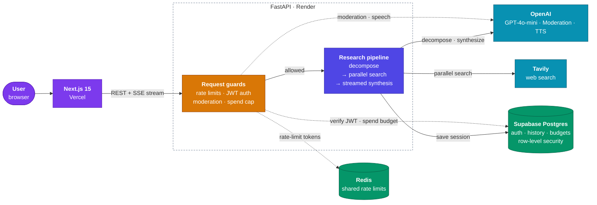
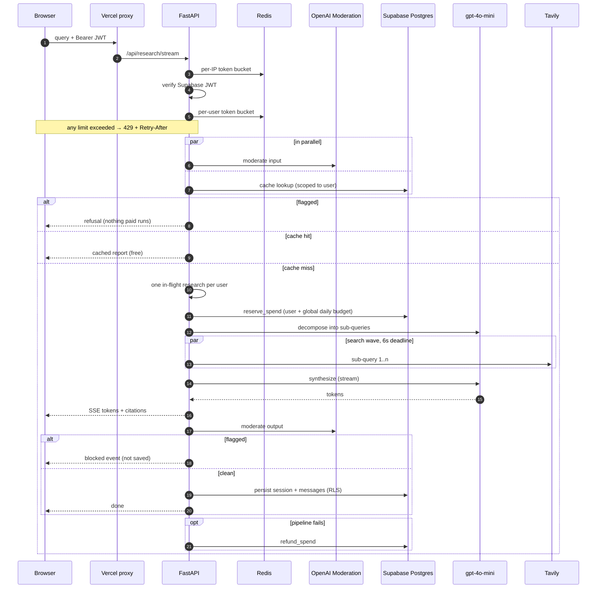

<div align="center">

# Vettan

### Multi-Step Web Research Assistant

**Think deeper. Discover faster.**

[](https://www.typescriptlang.org/)
[](https://react.dev/)
[](https://nextjs.org/)
[](https://fastapi.tiangolo.com/)
[](https://python.org/)
[](https://supabase.com/)
[](LICENSE)

[Live Demo](https://vettan-ai.vercel.app) • [Documentation](#api-documentation) • [Report Bug](../../issues) • [Request Feature](../../issues)

</div>

---

## Table of Contents

- [Overview](#overview)
- [Key Features](#key-features)
- [Architecture](#architecture)
- [Tech Stack](#tech-stack)
- [Getting Started](#getting-started)
- [Usage Examples](#-usage-examples)
- [API Documentation](#api-documentation)
- [Implementation Notes](#-implementation-notes)
- [Security](#security)
- [Deployment](#deployment)
- [Roadmap](#roadmap)
- [Contributing](#contributing)
- [License](#license)

---

## Overview

**Vettan** is a multi-step web research assistant that decomposes a user question into focused searches, executes them in parallel, ranks the retrieved results, and generates a report with selected source links.

### The Problem

AI-generated answers can be difficult to assess when they do not show which web sources informed the response. Vettan explores a source-aware workflow that makes the retrieved material visible to the user.

### The Solution

Vettan implements a **multi-step research pipeline** to:
- **Decompose** a question into 3-4 focused searches
- **Execute searches in parallel** and deduplicate results by URL
- **Rank and select** up to five sources for synthesis
- **Display selected source links** alongside the generated report
- **Maintain conversation context** across multiple turns with persistent storage
- **Generate accessible audio** versions of research with natural TTS

### Why Vettan?
```diff
- A generated answer without visible supporting material
+ A research report accompanied by the selected web sources
```

**Intended users:** Students, analysts, and knowledge workers who want AI-generated research accompanied by visible source links.

---

## Key Features

### **Advanced Research Engine**
- **Multi-source synthesis** - Searches several focused queries and synthesizes up to five ranked sources
- **Source display** - Shows the selected source titles, domains, and URLs
- **Follow-up conversations** - Uses recent stored messages to answer follow-up questions
- **Exact-query caching** - Reuses a stored result when the normalized query matches
- **Query decomposition** - Breaks complex queries into focused sub-questions

### **Research Interface**
- **Quality UI** - Premium animations, cascade effects, micro-interactions
- **64px search consistency** - Professional input sizing across all application views
- **Keyboard focus states** - Visible focus styling for supported controls
- **Dark mode optimized** - Carefully crafted contrast ratios and visual hierarchy
- **Fully responsive** - Seamless experience from 375px mobile to 4K displays
- **Keyboard navigation** - Complete accessibility with visible purple focus rings
- **Optimistic updates** - Instant UI feedback for favorites, rename, delete

### **Audio Generation**
- **Text-to-speech synthesis** - OpenAI TTS with 6 natural-sounding voice options
- **Accessibility-first** - Purpose-built for users with visual impairments
- **Voice selection** - Nova, Alloy, Echo, Fable, Onyx, Shimmer personalities
- **Download capability** - Export MP3 audio for offline listening
- **Real-time generation** - 3-5 second audio creation with progress feedback

### **Conversation Management**
- **Persistent history** - Supabase PostgreSQL-backed conversation threading
- **Favorites system** - Star and organize important research conversations
- **Real-time search** - Instant filtering across complete conversation history
- **Rename & delete** - Full CRUD operations with optimistic UI updates
- **Toast notifications** - Professional feedback for all user actions
- **Session recovery** - Load and continue any previous conversation

### **Voice Mode**
- **Real-time transcription** - Web Speech API for voice input
- **Particle visualization** - Beautiful voice activity animation
- **Hands-free research** - Conduct research without typing
- **Multi-language support** - Automatic language detection

---

## Architecture

### System Architecture

```mermaid
flowchart LR
    U(["<b>User</b><br/>browser"])
    FE["<b>Next.js 15</b><br/>Vercel"]

    subgraph API["FastAPI · Render"]
        direction LR
        G["<b>Request guards</b><br/>rate limits · JWT auth<br/>moderation · spend cap"]
        P["<b>Research pipeline</b><br/>decompose<br/>→ parallel search<br/>→ streamed synthesis"]
        G -->|"allowed"| P
    end

    OAI["<b>OpenAI</b><br/>GPT-4o-mini · Moderation · TTS"]
    TAV["<b>Tavily</b><br/>web search"]
    R[("<b>Redis</b><br/>shared rate limits")]
    DB[("<b>Supabase Postgres</b><br/>auth · history · budgets<br/>row-level security")]

    U --> FE
    FE -->|"REST + SSE stream"| G
    G -.->|"rate-limit tokens"| R
    G -.->|"verify JWT · spend budget"| DB
    G -.->|"moderation · speech"| OAI
    P -->|"decompose · synthesize"| OAI
    P -->|"parallel search"| TAV
    P -->|"save session"| DB

    classDef fe fill:#7c3aed,stroke:#5b21b6,color:#ffffff
    classDef guard fill:#d97706,stroke:#92400e,color:#ffffff
    classDef core fill:#4f46e5,stroke:#3730a3,color:#ffffff
    classDef ext fill:#0891b2,stroke:#155e75,color:#ffffff
    classDef store fill:#059669,stroke:#065f46,color:#ffffff
    classDef layer fill:transparent,stroke:#64748b,stroke-dasharray:4 3
    class U,FE fe
    class G guard
    class P core
    class OAI,TAV ext
    class R,DB store
    class API layer
```

<details>
<summary><b>Request lifecycle</b> — what happens on one <code>POST /api/research/stream</code></summary>


```mermaid
sequenceDiagram
    autonumber
    participant B as Browser
    participant V as Vercel proxy
    participant A as FastAPI
    participant R as Redis
    participant M as OpenAI Moderation
    participant P as Supabase Postgres
    participant L as gpt-4o-mini
    participant T as Tavily

    B->>V: query + Bearer JWT
    V->>A: /api/research/stream
    A->>R: per-IP token bucket
    A->>A: verify Supabase JWT
    A->>R: per-user token bucket
    Note over B,A: any limit exceeded → 429 + Retry-After
    par in parallel
        A->>M: moderate input
    and
        A->>P: cache lookup (scoped to user)
    end
    alt flagged
        A-->>B: refusal (nothing paid runs)
    else cache hit
        A-->>B: cached report (free)
    else cache miss
        A->>A: one in-flight research per user
        A->>P: reserve_spend (user + global daily budget)
        A->>L: decompose into sub-queries
        par search wave, 6s deadline
            A->>T: sub-query 1..n
        end
        A->>L: synthesize (stream)
        L-->>A: tokens
        A-->>B: SSE tokens + citations
        A->>M: moderate output
        alt flagged
            A-->>B: blocked event (not saved)
        else clean
            A->>P: persist session + messages (RLS)
            A-->>B: done
        end
        opt pipeline fails
            A->>P: refund_spend
        end
    end
```

</details>

### Defense in Depth
| Layer | Guard | Where |
|---|---|---|
| Edge | Per-IP token bucket, shared across workers via Redis | `backend/utils/rate_limit.py`, `rate_limit_http.py` |
| Identity | Supabase JWT on every API call; per-user buckets per endpoint class | `backend/main.py` |
| Content | OpenAI moderation on input (before any paid work) and on output. If moderation can't run, questions and audio are refused rather than let through | `backend/utils/moderation.py` |
| Cost | Atomic daily spend reservation per user and globally, refunded on failure | `backend/utils/spend_guard.py`, `supabase/migrations/0006_spend_guard.sql` |
| Data | Row-level security; backend queries with the caller's JWT, never an unscoped client | `supabase/migrations/0003_enable_rls.sql`, `backend/database/` |
| Detect | Refused requests (429, 401, moderation, spend cap, in-flight cap) and account deletions log a `[Security]` line. IPs are hashed and query text is never logged | `backend/utils/audit.py` |
| CI | Type-check, security regression tests, isolation / rate-limit / spend / moderation tests, dependency audit, secret scan | `.github/workflows/ci.yml` |

### Component Architecture
```
vettan-ai/
├── frontend/                        # Next.js 15 + React 19 + TypeScript (Vercel)
│   ├── src/
│   │   ├── app/                     # App Router: landing, /app, auth, legal pages
│   │   ├── components/
│   │   │   ├── auth/                # Sign-in / sign-up / password reset (Supabase Auth)
│   │   │   ├── landing/             # Marketing page sections
│   │   │   ├── layout/              # Sidebar: history, favorites, search
│   │   │   ├── legal/               # Terms, Privacy, Usage Policy rendering
│   │   │   ├── research/            # Chat, sources, audio player, voice mode, stats
│   │   │   ├── settings/            # Settings dialog
│   │   │   └── ui/                  # shadcn/ui primitives
│   │   ├── content/legal/           # Legal page content
│   │   ├── lib/
│   │   │   ├── api.ts               # Backend API client
│   │   │   ├── auth-fetch.ts        # Authenticated fetch (Bearer JWT, refusals)
│   │   │   ├── research-stream.ts   # SSE stream consumer
│   │   │   └── supabase/            # Browser, server and middleware clients
│   │   ├── middleware.ts            # Session refresh + route protection
│   │   └── __tests__/               # Vitest: security + unit regression tests
│   ├── vercel.json                  # /api/backend/* → Render rewrite
│   └── package.json
│
├── backend/                         # FastAPI + Python 3.11 (Render)
│   ├── main.py                      # App, auth dependency, endpoints, SSE streaming
│   ├── agent/
│   │   ├── research_pipeline.py     # Decompose → parallel Tavily search → synthesis
│   │   └── query_decomposer.py      # Sub-query generation
│   ├── audio/tts.py                 # OpenAI TTS, chunked for long text
│   ├── database/
│   │   ├── supabase_client_v2.py    # User-scoped client (RLS applies)
│   │   └── supabase_admin_client.py # Service-role client, account deletion only
│   ├── utils/
│   │   ├── rate_limit.py            # Token buckets, Redis-shared or in-memory
│   │   ├── rate_limit_http.py       # Per-IP middleware + per-user dependencies
│   │   ├── moderation.py            # OpenAI moderation on input and output
│   │   ├── spend_guard.py           # Daily per-user and global spend caps
│   │   ├── citation_extractor.py    # Citation parsing
│   │   └── token_tracker.py         # Token and cost accounting
│   ├── tests/                       # Isolation, rate limit, spend, moderation tests
│   ├── requirements.txt
│   ├── runtime.txt
│   └── Procfile
│
├── supabase/migrations/             # Schema, RLS, spend guard, profiles
└── .github/workflows/ci.yml         # Type-check, tests, build, audit, secret scan
```

### Data Flow
```
1. User submits query via sticky search bar
   ↓
2. Frontend sends POST /api/research/stream with the user's JWT
   (falls back to /api/research if streaming fails)
   ↓
3. Guards run: rate limits, auth, input moderation, cache check, spend cap
   ↓
4. FastAPI decomposes the question into 3-4 focused search queries
   ↓
5. Tavily searches run concurrently
   ├─ Results are deduplicated by URL
   ├─ Results are ranked by the returned relevance score
   └─ Up to five sources are selected
   ↓
6. GPT-4o-mini streams the report over SSE; output is moderated
   ↓
7. Selected source metadata is returned with the report
   ↓
8. Response + citations persisted to Supabase PostgreSQL
   ↓
9. The normalized query result is cached for an exact future match
   ↓
10. Frontend receives response and renders:
   ├─ User message bubble (gradient, right-aligned)
   ├─ AI research response (markdown-formatted)
   ├─ Collapsible sources section (cascade animation)
   ├─ Audio player component (TTS generation)
   └─ Research statistics panel (tokens, cost, sources)
```

### Key Architectural Decisions

| Decision | Rationale | Trade-off Considered |
|----------|-----------|---------------------|
| **Next.js App Router** | Server components, streaming support, optimal performance | Learning curve vs Pages router |
| **TypeScript Strict Mode** | Type safety, better DX, catch errors at compile time | Initial setup overhead |
| **FastAPI (async)** | Modern Python, automatic OpenAPI docs, async/await support | Less mature ecosystem than Django |
| **Supabase PostgreSQL** | Managed database, real-time subscriptions, built-in auth | Less control than self-hosted |
| **Tailwind CSS** | Utility-first, design consistency, no runtime overhead | Verbose HTML class names |
| **Multi-step research pipeline** | Separates query decomposition, retrieval, ranking, and synthesis | Generated claims still require user review |
| **SWR for caching** | Stale-while-revalidate pattern, automatic revalidation | vs TanStack Query or RTK Query |
| **shadcn/ui** | Customizable components, TypeScript native, Tailwind-based | Build own vs pre-made library |
| **Vercel + Render** | Zero-config deployment, global CDN, managed infrastructure | Vendor lock-in vs AWS flexibility |

---

## Tech Stack

### Frontend Stack
```json
{
  "framework": "Next.js 15 (App Router with Server Components)",
  "runtime": "React 19 (Server & Client Components)",
  "language": "TypeScript 5.0+ (strict mode enabled)",
  "styling": "Tailwind CSS 4 (utility-first)",
  "components": "shadcn/ui + custom components",
  "state_management": "React Hooks + SWR (stale-while-revalidate)",
  "data_fetching": "SWR (client) + fetch (server)",
  "icons": "Lucide React",
  "animations": "Tailwind transitions + CSS keyframes",
  "fonts": "Geist Sans + Geist Mono",
  "deployment": "Vercel (Edge Network, Global CDN)"
}
```

### Backend Stack
```json
{
  "framework": "FastAPI 0.109",
  "language": "Python 3.11",
  "server": "Uvicorn (ASGI server with async support)",
  "research_pipeline": "Custom async decomposition, parallel search, ranking, and synthesis",
  "llm": "OpenAI GPT-4o-mini",
  "search_api": "Tavily API (multi-source web search)",
  "audio": "OpenAI Text-to-Speech (TTS)",
  "database": "Supabase (Managed PostgreSQL 15)",
  "database_client": "supabase-py",
  "validation": "Pydantic 2.10",
  "environment": "python-dotenv",
  "deployment": "Render (managed Python hosting)"
}
```

### Agent Tools & Utilities
```python
{
  "research_pipeline": "Query decomposition, parallel search, ranking, and synthesis",
  "query_decomposer": "Generates 3-4 focused search queries",
  "citation_extractor": "Automatic citation parsing",
  "token_tracker": "Cost and usage monitoring"
}
```

### Infrastructure & Services

- **Frontend Hosting:** Vercel (Next.js optimized, 150+ edge locations)
- **Backend Hosting:** Render (Python/FastAPI with persistent containers)
- **Database:** Supabase (Managed PostgreSQL with real-time)
- **CDN:** Vercel Edge Network (global distribution)
- **AI Provider:** OpenAI (GPT-4o-mini + TTS)
- **Search Provider:** Tavily (professional web search API)
- **CI/CD:** GitHub → Auto-deploy to Vercel + Render

---

## Getting Started

### Prerequisites
```bash
# Required
node >= 18.0.0
python >= 3.11
postgresql >= 15 (or Supabase account)

```

### Quick Start (10 minutes)
```bash
# 1. Clone repository
git clone https://github.com/yasshh17/vettan-ai.git
cd vettan-ai

# 2. Backend setup
cd backend
python3 -m venv venv
source venv/bin/activate  # Windows: venv\Scripts\activate
pip install -r requirements.txt

# 3. Configure backend environment
cat > .env << 'EOF'
# AI Services
OPENAI_API_KEY=sk-proj-your-key-here
TAVILY_API_KEY=tvly-your-key-here

# Supabase Database
SUPABASE_URL=https://your-project.supabase.co
SUPABASE_KEY=your-anon-key-here
EOF

# 4. Start backend server
uvicorn main:app --reload --port 8000

# 5. Frontend setup (new terminal)
cd ../frontend
npm install

# 6. Configure frontend environment
cat > .env.local << 'EOF'
NEXT_PUBLIC_API_URL=http://localhost:8000
NEXT_PUBLIC_SUPABASE_URL=https://your-project.supabase.co
NEXT_PUBLIC_SUPABASE_ANON_KEY=your-anon-key
EOF

# 7. Start frontend development server
npm run dev

# 8. Open browser
# Navigate to: http://localhost:3000
```

**Vettan AI is now running locally!**

---

## Detailed Installation

### Backend Setup
```bash
cd backend

# Create virtual environment
python3.11 -m venv venv
source venv/bin/activate

# Upgrade pip
pip install --upgrade pip

# Install all dependencies
pip install -r requirements.txt

# Create environment file
cat > .env << 'EOF'
# AI Services
OPENAI_API_KEY=sk-proj-...
TAVILY_API_KEY=tvly-...

# Supabase Database
SUPABASE_URL=https://xxxxx.supabase.co
SUPABASE_KEY=eyJhbGc...
EOF

# Run development server
uvicorn main:app --reload --host 0.0.0.0 --port 8000

# API documentation available at:
# http://localhost:8000/docs (Swagger UI)
# http://localhost:8000/redoc (ReDoc)
```

### Frontend Setup
```bash
cd frontend

npm install

# Create environment file
cat > .env.local << 'EOF'
# Backend API endpoint
NEXT_PUBLIC_API_URL=http://localhost:8000

# Supabase Auth (anon key is public by design; RLS protects the data)
NEXT_PUBLIC_SUPABASE_URL=https://your-project.supabase.co
NEXT_PUBLIC_SUPABASE_ANON_KEY=your-anon-key

# Optional: App URL for metadata
NEXT_PUBLIC_APP_URL=http://localhost:3000
EOF

# Development mode with hot reload
npm run dev

# Production build (test locally)
npm run build
npm start

# Type checking
npx tsc --noEmit

# Tests (Vitest)
npm test
```

### Supabase Database Setup

The tables are `research_sessions` and `messages` (an older draft of this README
described a `conversations` table that was never built).

```sql
CREATE TABLE research_sessions (
  id UUID PRIMARY KEY DEFAULT gen_random_uuid(),
  user_id UUID REFERENCES auth.users(id) ON DELETE CASCADE,
  query TEXT NOT NULL,
  query_hash TEXT,
  report TEXT,
  citations JSONB,
  metadata JSONB,
  is_favorite BOOLEAN DEFAULT FALSE,
  created_at TIMESTAMP WITH TIME ZONE DEFAULT NOW(),
  updated_at TIMESTAMP WITH TIME ZONE DEFAULT NOW()
);

CREATE TABLE messages (
  id UUID PRIMARY KEY DEFAULT gen_random_uuid(),
  session_id UUID REFERENCES research_sessions(id) ON DELETE CASCADE,
  role TEXT NOT NULL CHECK (role IN ('user', 'assistant')),
  content TEXT NOT NULL,
  citations JSONB,
  metadata JSONB,
  created_at TIMESTAMP WITH TIME ZONE DEFAULT NOW()
);
```

#### Tenant isolation

`user_id`, the cascades, the indexes and the RLS policies are applied by the
migrations in [`supabase/migrations/`](supabase/migrations/) — run those rather
than copying DDL from this README:

| Migration | What it does | When to apply |
|---|---|---|
| `0001_add_user_id.sql` | Adds `research_sessions.user_id`, the FK cascades and the indexes | Non-breaking; apply first |
| `0002_backfill_legacy_sessions.sql` | Assigns pre-auth rows (`user_id is null`) to their owner | After `0001`, before `0003` — otherwise those rows become invisible to everyone |
| `0003_enable_rls.sql` | Enables RLS and adds `auth.uid()` policies on both tables | **Only after** the backend that forwards the caller's JWT is deployed |
| `0004_scope_query_hash_unique.sql` | Replaces the global `unique(query_hash)` with `unique(user_id, query_hash)` | Any time; non-breaking. Until it runs, a second account searching a query someone else already ran has its save silently rejected |
| `0005_drop_legacy_open_policies.sql` | Drops the two pre-existing `Allow anon full access` policies | **After `0003`.** Without it RLS reads as enabled but changes nothing: policies are OR-ed, so a leftover `using (true)` keeps both tables open to the anon key |

Run all five. After `0003`, confirm with the anon key and no JWT that
`GET /rest/v1/research_sessions?select=id` returns nothing. "RLS enabled" alone
proves nothing. RLS is `0003`, not `0002` — an earlier version of this table skipped
the backfill and numbered RLS as `0002`, so anyone following it enabled no RLS at
all and left the tables readable through the public anon key.

Isolation is enforced in two independent layers:

1. **Application layer** — every endpoint requires a valid Supabase JWT, and
   every query filters by the id derived from that token. A client-supplied
   `session_id` is never trusted on its own.
2. **Database layer** — RLS policies compare `user_id` to `auth.uid()`, so a
   query that forgets its user filter still returns nothing. This also closes
   direct access via the public anon key, which ships in the frontend bundle.

Rows created before `0001` have `user_id` NULL. They have no recoverable owner
and are deliberately invisible to every account.

---

## 📖 Usage Examples

### Basic Research Query
```typescript
// Every endpoint requires a Supabase access token:
// const { data: { session } } = await supabase.auth.getSession()
// const accessToken = session.access_token

// Submit research query via API
const response = await fetch('http://localhost:8000/api/research', {
  method: 'POST',
  headers: {
    'Content-Type': 'application/json',
    'Authorization': `Bearer ${accessToken}`  // Supabase session JWT
  },
  body: JSON.stringify({
    query: "What are the latest developments in fusion energy 2025?",
    use_cache: true
  })
})

const data = await response.json()

console.log(data.output)      // Markdown research report
console.log(data.citations)   // Array of {domain, url} objects
console.log(data.session_id)  // For follow-up queries
console.log(data.metadata)    // Pipeline name, selected-source count, and timing details
```

### Follow-up Conversation
```typescript
// Continue existing research with context
const followUp = await fetch('http://localhost:8000/api/research', {
  method: 'POST',
  headers: {
    'Content-Type': 'application/json',
    'Authorization': `Bearer ${accessToken}`  // Supabase session JWT
  },
  body: JSON.stringify({
    query: "How does this compare to traditional nuclear energy?",
    session_id: "previous-session-uuid",
    is_followup: true
  })
})

// Uses recent messages from the stored conversation as context
```

### Generate Audio Version
```typescript
// Convert research to natural speech
const audioResponse = await fetch('http://localhost:8000/api/audio', {
  method: 'POST',
  headers: {
    'Content-Type': 'application/json',
    'Authorization': `Bearer ${accessToken}`  // Supabase session JWT
  },
  body: JSON.stringify({
    text: researchOutput,
    voice: 'nova'  // Options: nova, alloy, echo, fable, onyx, shimmer
  })
})

const data = await audioResponse.json()

// Decode base64 audio
const audioBlob = new Blob(
  [Uint8Array.from(atob(data.audio), c => c.charCodeAt(0))],
  { type: 'audio/mpeg' }
)
const audioUrl = URL.createObjectURL(audioBlob)

// Play or download
const audio = new Audio(audioUrl)
audio.play()
```

### Manage Conversation History
```typescript
// Get all conversations
const auth = { 'Authorization': `Bearer ${accessToken}` }
const history = await fetch('http://localhost:8000/api/history', { headers: auth })
const { sessions } = await history.json()

// Rename conversation
await fetch(`http://localhost:8000/api/history/${sessionId}`, {
  method: 'PATCH',
  headers: { ...auth, 'Content-Type': 'application/json' },
  body: JSON.stringify({ query: "New Title" })
})

// Toggle favorite
await fetch(`http://localhost:8000/api/history/${sessionId}`, {
  method: 'PATCH',
  headers: { ...auth, 'Content-Type': 'application/json' },
  body: JSON.stringify({ is_favorite: true })
})

// Delete conversation
await fetch(`http://localhost:8000/api/history/${sessionId}`, {
  method: 'DELETE',
  headers: auth
})
```

---

## API Documentation

### Core Endpoints

#### **POST `/api/research`**

Generate comprehensive multi-source research report.

**Request:**
```typescript
interface ResearchRequest {
  query: string              // Research question (required)
  use_cache?: boolean        // Enable caching (default: true)
  session_id?: string        // For follow-up queries (optional)
  is_followup?: boolean      // Maintains context (default: false)
}
```

**Response:**
```typescript
interface ResearchResponse {
  output: string             // Markdown-formatted research report
  citations: Citation[]      // Array of source citations
  session_id: string         // Conversation UUID
  metadata: {
    pipeline: string         // Pipeline identifier
    sources_count: number    // Sources selected for synthesis
    sub_queries: string[]    // Generated focused searches
    total_time: number       // End-to-end duration in seconds
    timing: object           // Decomposition, search, and synthesis timing
  }
  messages: Message[]        // Full conversation thread
}

interface Citation {
  domain: string             // Source domain (e.g., "nature.com")
  url: string                // Full source URL
}
```

**Example:**
```bash
curl -X POST http://localhost:8000/api/research \
  -H "Content-Type: application/json" \
  -H "Authorization: Bearer $ACCESS_TOKEN" \
  -d '{
    "query": "Best AI coding assistants this year"
  }'
```

#### **POST `/api/audio`**

Generate natural speech from text using OpenAI TTS.

**Request:**
```typescript
interface AudioRequest {
  text: string               // Text to convert (max 15,000 chars; chunked internally)
  voice?: string             // Voice ID (default: 'nova')
                            // Options: nova, alloy, echo, fable, onyx, shimmer
}
```

**Response:**
```typescript
interface AudioResponse {
  audio: string              // Base64-encoded MP3 audio
  cost: number               // Estimated generation cost (USD)
  length_chars: number       // Characters converted
  voice: string              // Voice used
  format: "mp3"
}
```

#### **GET `/api/history`**

Retrieve user's conversation history.

**Response:**
```typescript
interface HistoryResponse {
  sessions: Session[]
}

interface Session {
  id: string                 // UUID
  query: string              // Conversation title (first query)
  created_at: string         // ISO timestamp
  is_favorite: boolean       // User-favorited status
}
```

#### **PATCH `/api/history/{session_id}`**

Update conversation metadata.

**Request:**
```typescript
interface UpdateSessionRequest {
  query?: string             // Rename conversation
  is_favorite?: boolean      // Toggle favorite status
}
```

#### **DELETE `/api/history/{session_id}`**

Delete conversation and all associated messages.

**Response:** `{ success: true, message: "Session deleted", session_id }` — `404` if the session does not exist or belongs to another user.

---

## ⚡ Implementation Notes

The repository does not currently include a reproducible benchmark suite for latency, cost savings, answer correctness, or accessibility scores. Those measures should be reported only after running a documented evaluation with a fixed query set and environment.

### Optimizations Implemented

**Frontend Performance:**
- Next.js automatic code splitting by route
- React Server Components for zero-JS pages
- SWR for intelligent client-side caching
- Dynamic imports for heavy components (voice-mode, audio-player)
- Image optimization with Next.js Image component
- Tailwind CSS purging (production bundle: ~8KB)
- Font optimization with next/font
- React.memo for expensive re-renders

**Backend Performance:**
- Async/await throughout (non-blocking I/O)
- Parallel web searches with asyncio.gather
- Exact normalized-query result caching
- Supabase connection pooling
- Pydantic validation (fast C-based parsing)
- Response streaming for large outputs

### Current limitations

- Source links show which retrieved pages informed synthesis; they do not prove that every generated claim is supported.
- The active pipeline uses one language-model synthesis step and should not be described as a multi-agent system.
- Retrieval quality and citation coverage have not yet been formally evaluated in this repository.

---

## Security

### API Key Management
```bash
# All sensitive credentials in environment variables
OPENAI_API_KEY - Never exposed to frontend
TAVILY_API_KEY - Server-side only
SUPABASE_KEY - Anon key safe, service key protected

# .env files NEVER committed to Git
.gitignore properly configured
Separate .env for development/production
```

### Backend Security Measures
```python
# Implemented protections:
CORS middleware (configurable allowed origins)
Input validation with Pydantic schemas
SQL injection prevention (parameterized queries via Supabase client)
Rate limiting (configurable per endpoint)
Error handling (no stack traces in production)
HTTPS enforcement in production
Environment-based configuration
```

### Frontend Security
```typescript
// React built-in protections:
Auto-escaping prevents XSS attacks
Content Security Policy headers
HTTP-only cookies (if using auth)
No eval() or dangerous code execution
Sanitized user inputs
Secure API communication (HTTPS only in production)
```

### Dependency Security
```bash
# Regular security audits
npm audit fix  # Frontend dependencies
pip-audit      # Backend dependencies

# Automated updates
# Dependabot enabled on GitHub (checks weekly)
```

---

## Deployment

### Production Deployment Guide

#### **1. Frontend Deployment (Vercel)**
```bash
# Automatic via GitHub integration
# Every push to main branch auto-deploys

# Manual deployment (if needed):
cd frontend
npx vercel --prod

# Environment Variables (set in Vercel dashboard):
# Settings → Environment Variables → Add:
NEXT_PUBLIC_API_URL=https://vettan-ai.onrender.com
```

**Configuration:**
- **Framework Preset:** Next.js (auto-detected)
- **Root Directory:** `frontend`
- **Build Command:** `npm run build`
- **Output Directory:** `.next` (default)
- **Install Command:** `npm install`

**Live URL:** `https://vettan-ai.vercel.app`

---

#### **2. Backend Deployment (Render)**
```bash
# Automatic via GitHub integration

# Manual setup:
# 1. Connect GitHub repo at render.com
# 2. Select "vettan-ai" repository
# 3. Root Directory: backend
# 4. Language: Python 3
# 5. Branch: main
# 6. Build Command: pip install -r requirements.txt
# 7. Start Command: uvicorn main:app --host 0.0.0.0 --port $PORT
```

**Environment Variables (Render dashboard):**
```bash
OPENAI_API_KEY=sk-proj-...
TAVILY_API_KEY=tvly-...
SUPABASE_URL=https://xxxxx.supabase.co
SUPABASE_KEY=eyJhbGc...

# Service role key, used ONLY for auth.admin.delete_user during account
# deletion. Without this, GET /health reports account_deletion_configured:
# false and every delete-account request 503s.
SUPABASE_SERVICE_ROLE_KEY=eyJhbGc...
```

**Configuration Files:**

`Procfile`:
```
web: uvicorn main:app --host 0.0.0.0 --port $PORT
```

`runtime.txt`:
```
python-3.11.6
```

**Live API:** `https://vettan-ai.onrender.com`

---

#### **3. Database (Supabase)**
```bash
# Already managed - no deployment needed
# Access at: https://app.supabase.com

# Connection details in SUPABASE_URL and SUPABASE_KEY
# Tables created via Supabase dashboard or SQL editor
```

---

### Environment Variables Reference

**Frontend (`.env.local`):**
```bash
# Development
NEXT_PUBLIC_API_URL=http://localhost:8000
NEXT_PUBLIC_SUPABASE_URL=https://your-project.supabase.co
NEXT_PUBLIC_SUPABASE_ANON_KEY=your-anon-key

# Production (set in Vercel)
NEXT_PUBLIC_API_URL=https://vettan-ai.onrender.com
```

**Backend (`.env`):**
```bash
# AI Services
OPENAI_API_KEY=sk-proj-...
TAVILY_API_KEY=tvly-...

# Database (Supabase)
SUPABASE_URL=https://your-project.supabase.co

# MUST be the anon key, not the service role key. The backend forwards each
# caller's JWT on top of it so auth.uid() resolves and RLS applies. A service
# role key bypasses RLS entirely and would silently disable the database-layer
# half of the tenant isolation.
SUPABASE_KEY=your-anon-key

# Service role key, used ONLY for auth.admin.delete_user during account
# deletion. Never used for research or history queries.
SUPABASE_SERVICE_ROLE_KEY=your-service-role-key

# ── Rate limiting ────────────────────────────────────────────────────────
# All optional; the defaults shown are what the app uses if unset. Capacity is
# the burst a caller may fire back-to-back; refill is the sustained rate.
RATE_LIMIT_ENABLED=true
RATE_LIMIT_TRUSTED_HOPS=1       # proxies in front of the app; 0 for local dev
RATE_LIMIT_MAX_KEYS=50000

RATE_LIMIT_IP_CAPACITY=100       # pre-auth, per client address
RATE_LIMIT_IP_REFILL_PER_MIN=60
RATE_LIMIT_RESEARCH_CAPACITY=20  # /api/research AND /api/research/stream
RATE_LIMIT_RESEARCH_REFILL_PER_MIN=10
RATE_LIMIT_AUDIO_CAPACITY=10
RATE_LIMIT_AUDIO_REFILL_PER_MIN=5
RATE_LIMIT_READ_CAPACITY=60
RATE_LIMIT_READ_REFILL_PER_MIN=60
RATE_LIMIT_WRITE_CAPACITY=30
RATE_LIMIT_WRITE_REFILL_PER_MIN=30
RATE_LIMIT_ACCOUNT_CAPACITY=3
RATE_LIMIT_ACCOUNT_REFILL_PER_MIN=1

# In-flight cap. A rate limit bounds how often requests start, not how many
# run at once; a research request holds a threadpool slot plus several
# upstream connections for its whole duration.
RESEARCH_MAX_CONCURRENT_PER_USER=2
RESEARCH_MAX_CONCURRENT_GLOBAL=8     # per worker
RESEARCH_SLOT_LEASE_SECONDS=120

# ── Redis (needed for more than one worker) ──────────────────────────────
REDIS_URL=redis://localhost:6379/0
REDIS_TIMEOUT_SECONDS=0.25
REDIS_RETRY_AFTER_SECONDS=5
REDIS_MAX_CONNECTIONS=10        # per worker; workers x instances x this must fit the plan
WEB_CONCURRENCY=1               # uvicorn workers; only raise with REDIS_URL set

# ── Moderation ───────────────────────────────────────────────────────────
MODERATION_TIMEOUT_S=3          # per attempt
MODERATION_ATTEMPTS=2           # a cold connection after a restart gets one retry
MODERATION_FAIL_CLOSED=input,audio   # sources refused when moderation can't run; true = all, false = none

# ── Security log ─────────────────────────────────────────────────────────
AUDIT_IP_SALT=change-me         # any random string; used to hash IPs in [Security] logs
```

> **Set `REDIS_URL` before scaling out.** Without it, rate limits live in each
> worker's memory, so N workers means N times the limit (the app warns about
> this at startup). With it, all workers share one set of limits. If Redis goes
> down, each worker falls back to its own limits and logs an error. On Render,
> use a Key Value instance in the same region as the API.

---

## Roadmap

### Completed (v1.0 - Current)
- [x] Multi-turn conversational AI with full context preservation
- [x] Parallel web searches with up to five ranked sources selected for synthesis
- [x] Selected source metadata displayed with the generated report
- [x] Audio generation with 6 voice options (OpenAI TTS)
- [x] Conversation history with Supabase PostgreSQL
- [x] Favorites, rename, delete with optimistic updates
- [x] Responsive dark-mode UI
- [x] Exact normalized-query result caching
- [x] Voice mode with real-time transcription
- [x] Professional toast notifications
- [x] Complete keyboard navigation and accessibility
- [x] Mobile-responsive sidebar with overlay pattern

---

## Contributing

Contributions are welcome. Open an issue to discuss larger changes before submitting a PR.

### Development Workflow
```bash
# 1. Fork the repository on GitHub

# 2. Clone your fork
git clone https://github.com/yasshh17/vettan-ai.git
cd vettan-ai

# 3. Create feature branch
git checkout -b feature/your-feature-name

# 4. Make your changes
# - Write tests for new features
# - Update documentation
# - Follow existing code style

# 5. Test your changes
(cd frontend && npx tsc --noEmit && npm test)    # Typecheck + Vitest
cd backend && pip install -r requirements-dev.txt
python tests/test_isolation.py     # Tenant isolation + schema readiness
python tests/test_rate_limit.py    # Rate limiting
python tests/test_spend_guard.py   # Spend caps
python tests/test_moderation.py    # Moderation
# The backend suites are standalone scripts, not pytest — run them directly.
# CI runs all of the above on every push (.github/workflows/ci.yml).

# 6. Commit with conventional commits
git commit -m "feat: add amazing feature"
# Types: feat, fix, docs, style, refactor, test, chore

# 7. Push to your fork
git push origin feature/your-feature-name

# 8. Open Pull Request
# - Clear description of changes
# - Reference related issues
# - Include screenshots for UI changes
```

### Code Quality Standards

- **TypeScript:** Strict mode, checked in CI with `tsc --noEmit`
- **Python:** Type hints and docstrings
- **Testing:** New behaviour ships with a regression test; CI must pass
- **Security:** Dependency audit and secret scan run in CI
- **Commits:** Conventional Commits
- **Documentation:** Update docs with code changes

---

## License

This project is licensed under the **MIT License** - see the [LICENSE](LICENSE) file for details.
```
MIT License - Free to use, modify, and distribute
Commercial use allowed
Attribution appreciated but not required
```

---

## Acknowledgments

Built with exceptional open-source tools and services:

### Core Framework & Libraries
- [Next.js](https://nextjs.org/) - The React Framework for Production
- [React](https://react.dev/) - JavaScript Library for User Interfaces
- [FastAPI](https://fastapi.tiangolo.com/) - Modern Python Web Framework
- [Tailwind CSS](https://tailwindcss.com/) - Utility-First CSS Framework

### AI & Data Services
- [OpenAI](https://openai.com/) - GPT-4o-mini LLM + TTS API
- [Tavily](https://tavily.com/) - Professional Web Search API
- [Supabase](https://supabase.com/) - Open Source Firebase Alternative

### UI Components & Tools
- [shadcn/ui](https://ui.shadcn.com/) - Re-usable Component System
- [Lucide](https://lucide.dev/) - Beautiful Consistent Icons
- [Radix UI](https://www.radix-ui.com/) - Unstyled Accessible Components

### Infrastructure & Deployment
- [Vercel](https://vercel.com/) - Frontend Hosting & CDN
- [Render](https://render.com/) - Backend Hosting
- [Supabase](https://supabase.com) - Database & Authentication

Special thanks to the open-source AI/ML community for advancing the field and making sophisticated research tools accessible.

---

## Contact

**Developer:** Yash Tambakhe

[](https://github.com/yasshh17)
[](https://www.linkedin.com/in/yash-tambakhe/)
[](mailto:yashtambakhe@gmail.com)

**🔗 Links:**
- **Live Demo:** [vettan-ai.vercel.app](https://vettan-ai.vercel.app)
- **Source Code:** [github.com/yasshh17/vettan-ai](https://github.com/yasshh17/vettan-ai)

---

<div align="center">

### ⭐ Star this repository if Vettan helps your research workflow!

**Questions or suggestions?** [Open an issue](../../issues)

---

**Built by [Yash Tambakhe](https://github.com/yasshh17)**

*Source-aware web research in one interface*

</div>
